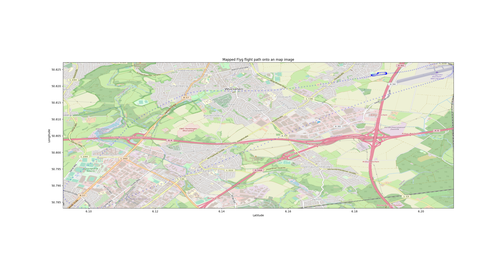

# Plot Flyg Data Points
This scripts can be used to plot a Flyg data recording (`*.flyg`) onto an image of a map provided by
[Open Street Maps](https://www.openstreetmap.org/).

## Howto use the tools
1. Clone this repository (e.g. `git clone git@github.com:flying7eleven/plot-flyg-data-points.git`)
2. Create a new virtual environment in the path of the cloned repository (e.g. `python3 -m venv venv`)
3. Activate the virtual environment (e.g. `source venv/bin/activate`)
4. Install the required dependencies (e.g. `pip3 install --requirement requirements.txt`)
5. Use `determine_dimensions.py` for extracting the left, top, right and bottom boundaries for the image we want to export from OSM (e.g. `python3 determine_dimensions.py examples/first_sample_flight.flyg`)
6. Go to [export OpenStreetMap](https://www.openstreetmap.org/export) and enter the coordinates determined in the step above
7. Use the `Share` option on the on the right side to export the map area image as an image and download it (for more information 
   see [this medium article by Ahmed Qassim](https://medium.com/@abuqassim115/thanks-for-your-response-frank-fb869824ede2))
8. Use `python3 plot_path.py examples/first_sample_flight.flyg examples/first_sample_flight_map.png` for actual plotting the path to the image

### An example how to plot should look like
